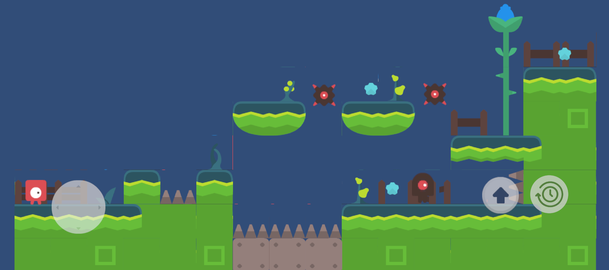

# ⏳ TimeBubble_2D

> A 2D game featuring a time manipulation mechanic for dynamic gameplay control.

---

## 🎥 Gameplay

  

---

## 📸 Preview

  

---

## 🧠 What I Built

* Time scaling mechanic  
* Player movement and interaction system  
* Slow-motion gameplay logic  

---

## 🚀 Features

* Time manipulation gameplay  
* Responsive controls  
* Dynamic pacing  

---

## ⚙️ Tech Stack

  

---

## ▶️ How to Run

1. Clone repository  
2. Open in Unity  
3. Press Play  

---
